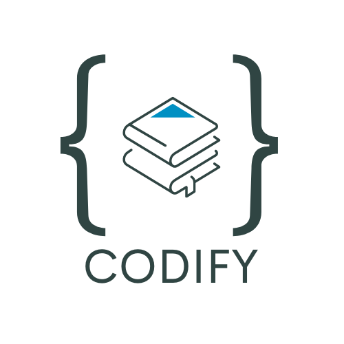

<p align="center">

</p>

Codify is a collaborative project by <a href="https://github.com/AlexJackson01">Alex Jackson</a>, <a href="https://github.com/minoi001"> Imogen Minoli </a>, and <a href="https://github.com/seonaid-mcnabb/"> Seonaid McNabb </a>.

No matter your background, learning to program requires discipline and dedication, along with the ability to evaluate your own errors, learn from your mistakes, and sift through massive amounts of information in order to find code solutions that work for your needs.

We designed Codify with our own experience as bootcamp students in mind, hoping to provide tools to facilitate some of the practical, organizational needs of programmers, as well as to provide spaces that encourage active learning.

In its current iteration, Codify has the following features:

- A quiz that students can use to regularly test their knowledge of popular programming languages
- An interactive whiteboard that can be used to visualize programming concepts, take, and save notes
- A personalized, searchable Q&A feature that encourages students to document their own questions and answers throughout their learning process, which can be reviewed regularly
- A searchable How-To blog where programmers can build a collection of their own instructions/tutorials related to coding tasks
- A customizable work priorities list (particularly geared towards career-changers)

# Technologies used

Front end:

- React
- React Router
- React-icons
- CSS / Chakra UI
- Figma for design mock-up
- Canva for logo
- HTML5 Canvas for whiteboard
- Roughjs, Perfect Freehand, React color, and Flaticon for drawing tools
- Quiz API for quiz questions
- Draft-js, DOMPurify, and html-react-parser for text editor
- Jest
- Enzyme

Backend:

- MySQL
- ExpressJS

&nbsp;

# Set up

- Clone the repository
- Run ```npm install``` to install packages

Start the back-end:

- ```cd my-express-app```
- ```npm install```
- ```npm run migrate``` (only necessry the first time you run the project)
- ```npm start```

Start the front-end

- ```cd .. to return to root```
- ```cd client```
- ```npm install```
- ```npm start```

The app will run on ```http://localhost:3000``` as the default port and the back-end will run on ```http://localhost:5001```.

# API keys

TODO: add description of API key set-up for QuizAPI

### **The API calls should now work as expected!**

## Notes About Testing

This project uses Jest and Enzyme for testing. Jest is a Javascript testing framework, and Enzyme helps to simplify test-writing.

## Next steps

Ideas for how we'd like to develop the project include:

- Adding a student and instructor log-in
- Adding a public "classroom" area where students can share information and resources, and contribute to a collaborative cheat-sheet
- A reflection blog area where students can regularly upload entries reflecting on what they've learned, what strategies worked for them, and set future learning goals
- A coding resource collection where students can upload tutorials, videos, articles, and links to resources
- An "unrelated" resources board, where students can upload articles, videos, etc. of concepts not directly related to programming, but which have deepened or expanded their understanding of the topic
- Linking back-end tables with tags in order to facilitate a global search of all resources and student entries
-An area to save frequqently used code snippets and templates
- More advanced styling and search methods

_This is a student project that was created at [CodeOp](http://codeop.tech), a full stack development bootcamp in Barcelona._
